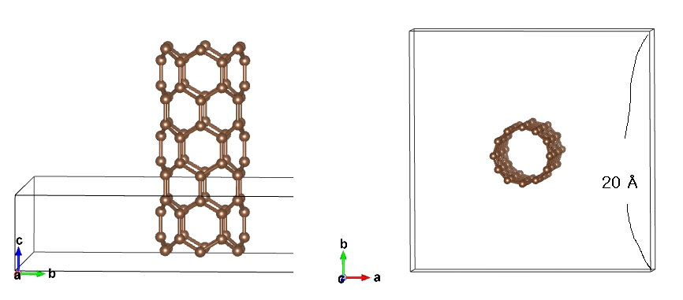

# Carbon Nanotubes' VESTA Geometry File (VASP POSCAR)

Zigzag Carbon Nanotube (6, 0)

***

- 00allCNT_samples_CIF.zip / 00allCNT_samples_VASP_fraction.zip
contains 8 Carbon nanotubes (5, 5), (6, 6), (7, 7), (8, 8) / (5, 0), (6, 0), (7,0), (8, 0)
