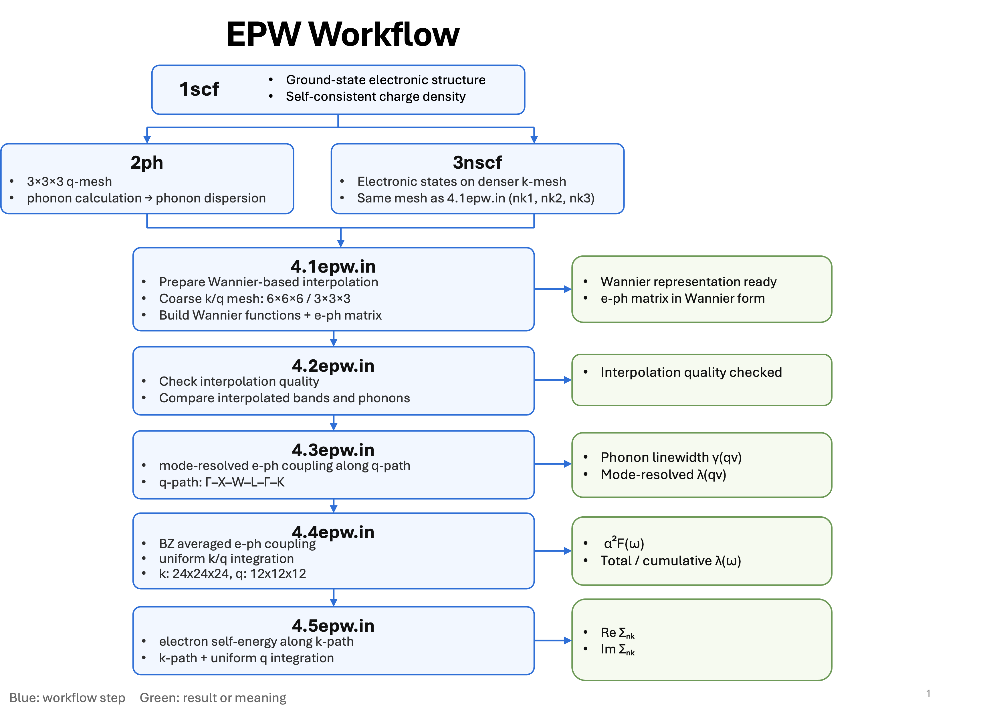
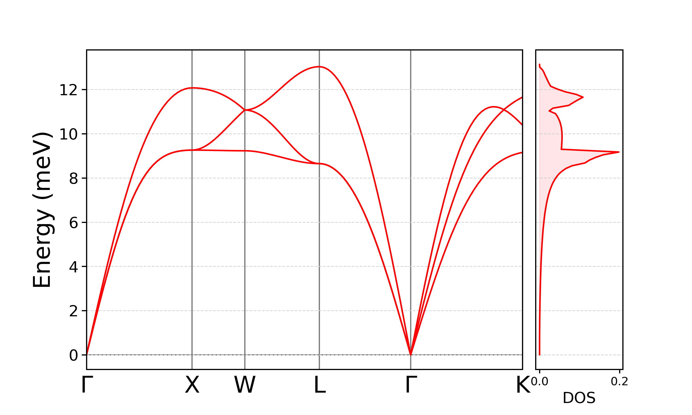
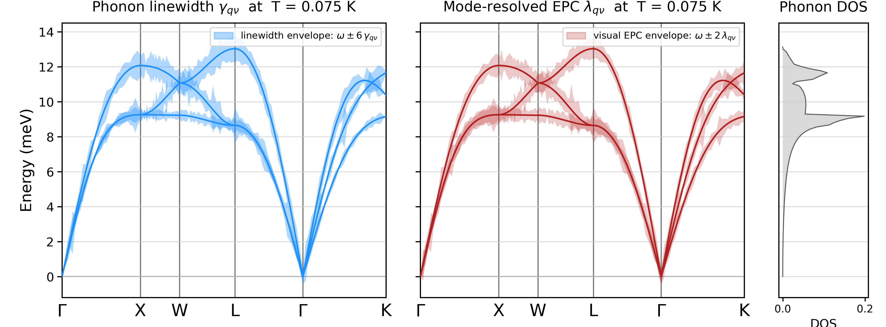
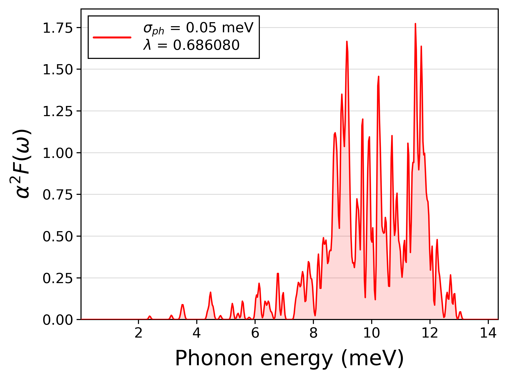
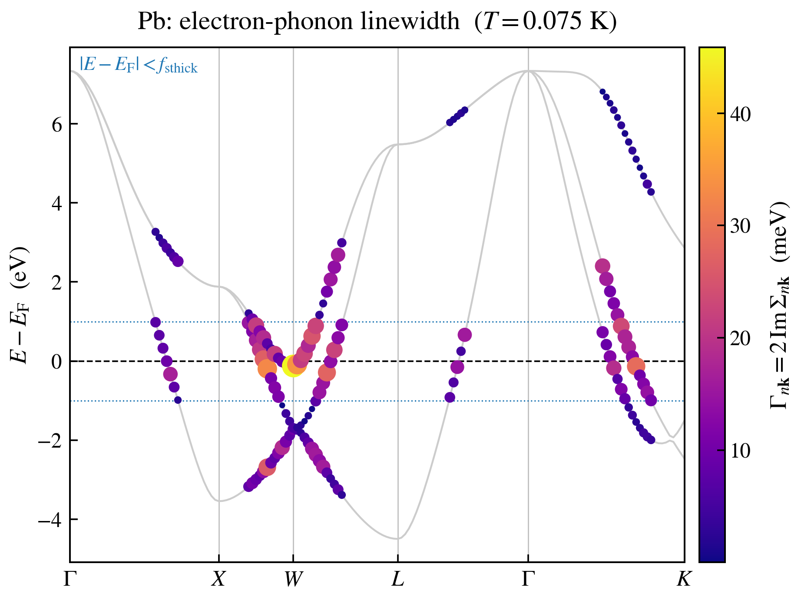

## Pb EPW Example

### Workflow

### Phonon Dispersion

### Phonon Linewidth & Electron–Phonon Coupling
Mode-resolved phonon linewidth and electron–phonon coupling.

### Eliashberg Spectral Function
The Eliashberg spectral function, α²F(ω), was calculated using EPW, giving an electron–phonon coupling constant of λ = 0.686.

### Electron Self-Energy
`99elself.py` post-processes `linewidth.elself.0.075K` and analyzes the electron self-energy along the selected k-path.

For states within 50 meV of the Fermi level:
- Mean linewidth: 16.198 meV
- Maximum linewidth: 26.862 meV
- Mean lifetime: 48.19 fs

### References

- [EPW School / Tutorial 01](https://docs.epw-code.org/tutorials/tutorial_01/index.html)
- [EPW FCC Lead Tutorial](https://docs.epw-code.org/tutorials/FCC-lead.html)
- [EPW Input Variables](https://docs.epw-code.org/doc/Inputs.html)
- [EPW: Electron–phonon coupling using Wannier functions](https://arxiv.org/abs/1604.03525)
