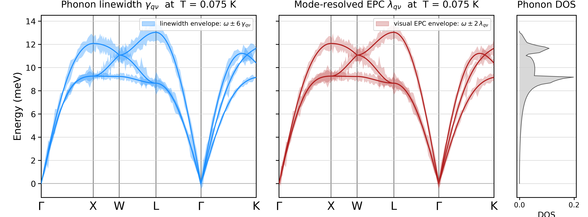
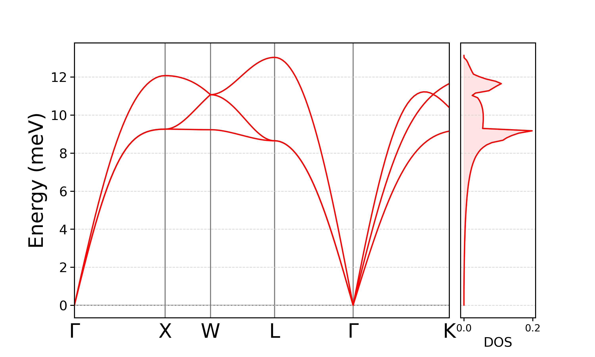
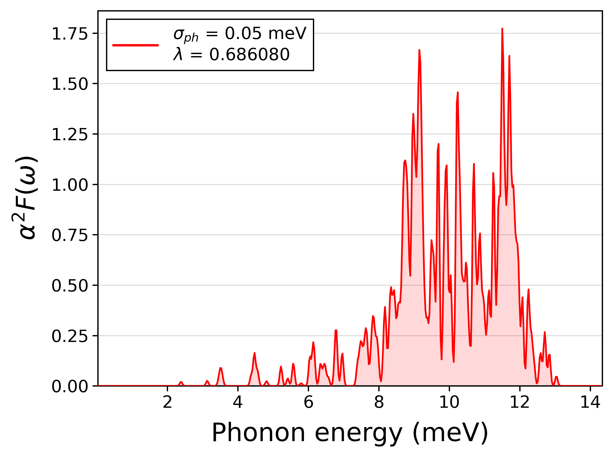
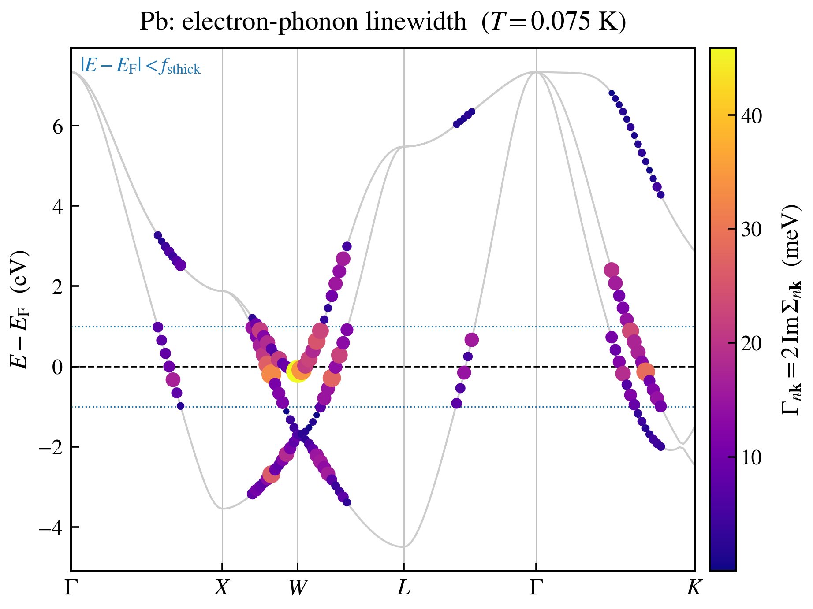
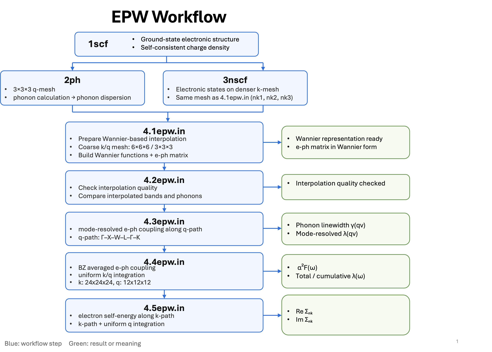

# Electron–Phonon Scattering in Pb

**Mode-resolved coupling, linewidths, self-energy, and quasiparticle lifetimes**

## Question

**How strongly does electron–phonon scattering vary across phonon modes and electronic states?**

A linewidth can contain contributions from several scattering channels,

```math
\Gamma_{\mathrm{tot}}
\approx
\Gamma_{\mathrm{e-ph}}
+
\Gamma_{\mathrm{ph-ph}}
+
\Gamma_{\mathrm{defects}}
+\cdots .
```

This project focuses on the electron–phonon contribution in fcc Pb and resolves its dependence on phonon mode, momentum, and electronic state.

---

## Key Result: Mode-Resolved Phonon Scattering

The most direct view of the momentum- and mode-dependent interaction is given by the phonon linewidth $\gamma_{\mathbf q\nu}$ and the mode-resolved coupling strength $\lambda_{\mathbf q\nu}$.

* $\gamma_{\mathbf q\nu}$ describes the electron–phonon contribution to phonon broadening.
* $\lambda_{\mathbf q\nu}$ measures the dimensionless coupling strength associated with an individual phonon mode.

The figure below maps both quantities directly onto the phonon branches.

The blue envelope is plotted as

```math
\omega_{\mathbf q\nu}
\pm
6\gamma_{\mathbf q\nu},
```

so broader blue regions indicate larger phonon linewidths.

The red envelope is plotted as

```math
\omega_{\mathbf q\nu}
\pm
2\lambda_{\mathbf q\nu},
```

as a visual encoding of the relative mode-resolved coupling strength. Because $\lambda_{\mathbf q\nu}$ is dimensionless, the red width is not a physical spectral linewidth.

<p align="center">
  <a href="4epw/linewidth_lambda_T0000.075K.png">
    
  </a>
</p>

The variation along the phonon branches shows that electron–phonon scattering is strongly dependent on mode and momentum and cannot be represented fully by a single averaged coupling constant.

---

## Phonon Dispersion

The phonon dispersion provides the lattice-dynamical basis for the mode-resolved analysis.

The selected high-symmetry path is

```math
\Gamma \rightarrow X \rightarrow W \rightarrow L \rightarrow \Gamma \rightarrow K .
```

<p align="center">
  <a href="phonon_dispersion.png">
    
  </a>
</p>

---

## Eliashberg Spectral Function

The Eliashberg spectral function $\alpha^2F(\omega)$ resolves the electron–phonon interaction by phonon frequency.

The cumulative coupling is

```math
\lambda(\omega)
=
2\int_0^\omega
\frac{\alpha^2F(\omega')}{\omega'}
\,d\omega' ,
```

and the total electron–phonon coupling constant is

```math
\lambda
=
2\int_0^\infty
\frac{\alpha^2F(\omega)}{\omega}
\,d\omega .
```

For the present calculation,

```math
\lambda \approx 0.686 .
```

The frequency dependence of $\alpha^2F(\omega)$ identifies which parts of the phonon spectrum contribute most strongly to the integrated coupling.

<p align="center">
  <a href="4epw/a2f.png">
    
  </a>
</p>

---

## Electron Self-Energy, Quasiparticle Linewidth, and Lifetime

Electron–phonon scattering modifies the electronic states through the electron self-energy,

```math
\Sigma_{n\mathbf{k}}(\omega)
=
\mathrm{Re}\,\Sigma_{n\mathbf{k}}(\omega)
+
i\,\mathrm{Im}\,\Sigma_{n\mathbf{k}}(\omega) .
```

The real part shifts the quasiparticle energy, while the imaginary part produces a finite spectral linewidth.

In the present post-processing (`calc/4epw/99elself.py`), the plotted on-shell linewidth is defined as

```math
\Gamma^{\mathrm{plot}}_{n\mathbf{k}}
=
2\left|
\mathrm{Im}\,\Sigma_{n\mathbf{k}}
\right| ,
```

with the corresponding lifetime estimate

```math
\tau_{n\mathbf{k}}
\approx
\frac{\hbar}
{\Gamma^{\mathrm{plot}}_{n\mathbf{k}}} .
```

This estimate neglects the quasiparticle renormalization factor $Z$.

<p align="center">
  <a href="4epw/elself_bands.png">
    
  </a>
</p>

For the sampled states along the selected high-symmetry path within $50\,\mathrm{meV}$ of the Fermi level $E_F$:

* Mean linewidth: $16.198\,\mathrm{meV}$
* Maximum linewidth: $26.862\,\mathrm{meV}$
* Mean quasiparticle lifetime: $48.19\,\mathrm{fs}$

These values provide an estimate of the electron–phonon scattering timescale for the selected low-energy electronic states.

---

## Workflow

<p align="center">
  <a href="EPW_workflow.png">
    
  </a>
</p>

The main stages are:

| Stage | Purpose |
|---|---|
| `1scf` | Ground-state electronic structure |
| `2ph` | DFPT phonons and perturbation potentials |
| `3nscf` | Dense electronic states for Wannier interpolation |
| `4.1epw` | Wannierization and coarse electron–phonon matrix elements |
| `4.2epw` | Interpolation check |
| `4.3epw` | Mode- and q-resolved phonon linewidths and $\lambda_{\mathbf q\nu}$ |
| `4.4epw` | $\alpha^2F(\omega)$ and integrated electron–phonon coupling |
| `4.5epw` | Electron self-energy, linewidths, and quasiparticle lifetimes |

After the `1scf`, `2ph`, and `3nscf` calculations with Quantum ESPRESSO 7.5, the electron–phonon quantities are evaluated and interpolated using EPW 6.0.

**First-principles analysis of electron–phonon scattering in fcc Pb using Quantum ESPRESSO 7.5 and EPW 6.0.**

---

## References

* [EPW School / Tutorial 01 (FCC Lead)](https://docs.epw-code.org/tutorials/tutorial_01/index.html)
* [EPW Input Variables](https://docs.epw-code.org/doc/Inputs.html)
* [EPW: Electron–phonon coupling using Wannier functions](https://arxiv.org/abs/1604.03525)
* G. D. Mahan, *Many-Particle Physics*, 3rd ed.
